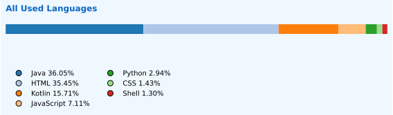

<!-- 🎥 Banner -->

---

## 🚀 About Me
I’m **Aseel Abd Elhaq**, a Computer Science student at **Birzeit University (2022–2026)** with a strong passion for creating technology that makes life easier.  
I enjoy building **mobile apps** and **web platforms**, combining clean design with solid engineering.  
My focus is on **Android development (Kotlin & Java)**, **full-stack web applications**, and **database systems**.  

---

## 📊 GitHub Stats
  

---

## 📈 All Used Languages in Account (Auto-Updated)
This chart aggregates language usage across **all owned repositories, including forks** (archived excluded).  
Tiny/noise languages are filtered out automatically.

  

---

## 🌐 Connect With Me

---

## 🛠 Languages and Tools

  
  
  
  
  
  
  
  
  
  

